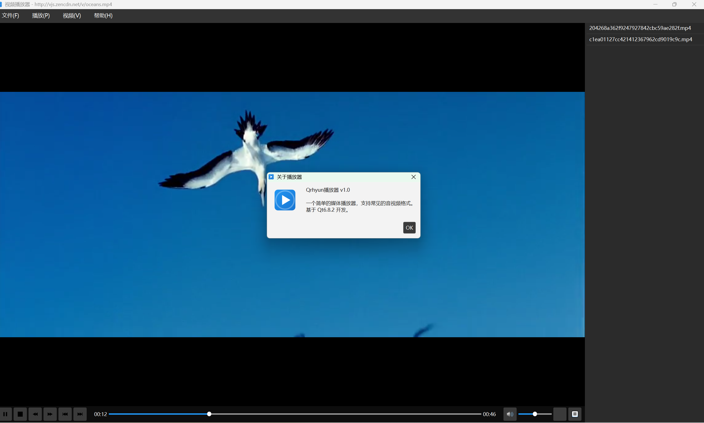
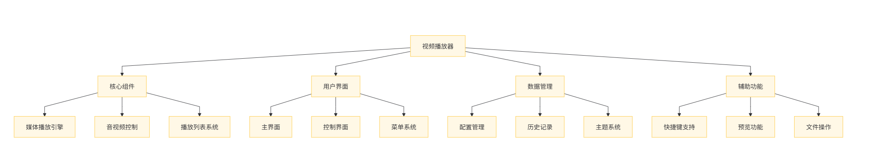
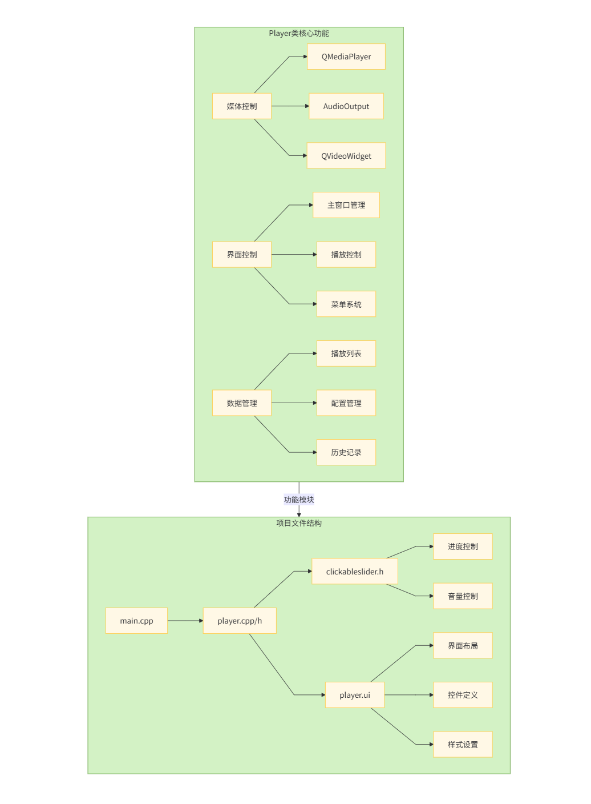

### :rocket:SparkPlayer音频播放器
> 项目使用了Qt的 `QMediaPlayer` 和 `QVideoWidget` 等`Qt`多媒体组件, `.pro` 文件中引入了` multimedia `和 `multimediawidgets` 模块这是Qt自带的多媒体播放解决方案

### :robot: [体验](https://github.com/Qrhyun/SparkPlayer/blob/main/build/Desktop_Qt_6_8_2_MinGW_64_bit-Debug/debug/spark_player.exe)



### :construction:总体框架图

## :beers:详细框架图（按文件组织）


### :construction_worker:核心功能
```md
- 视频播放控制功能---包含播放/暂停，停止，快进，快退
- 播放列表管理---包含添加，删除，双击播放文件
- 预览功能---包含鼠标移动到进度条，计算预览位置，显示预览窗口和时间标签
- 网络流媒体支持---包含输入URL
- 播放历史记录管理---包含添加，清除，查看历史
- 全屏播放功能---包含普通窗口，全屏状态，显示与隐藏菜单栏
- 音频控制功能---包含音量调节和设置静音
- 快捷键支持---包含空格（播放/暂停），方向键（快进/快退），ESC键（全屏切换），M键（静音切换）
- 截图功能
- 进度条控制和预览功能---包含鼠标移动，鼠标点击，鼠标离开
- 播放模式管理---包含顺序播放，列表播放，单曲循环，随机播放
- 配置管理，UI主题定制
- 错误处理机制---涉及更新UI状态
- 拖放文件支持---分单个文件（直接播放），多个文件（添加到播放列表）， 还有不支持
```

